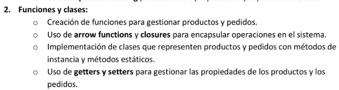
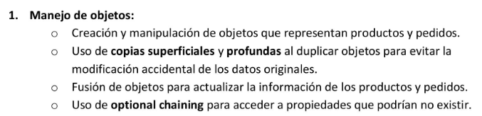

# Para el ejercicio 2:
## Existen dos códigos: 

### - Ejercicio2_Funciones_y_Clases
Este código responde a la característica/requisito de Manejo de Objetos y todos sus requisitos internos:

### - Ejercicio2_Manejo_de_Objetos
Este código responde a la característica/requisito de Funciones y Clases y todos sus requisitos internos:

## Todas mis lineas de código estan comentadas a medida que desarrollaba mis ideas...
