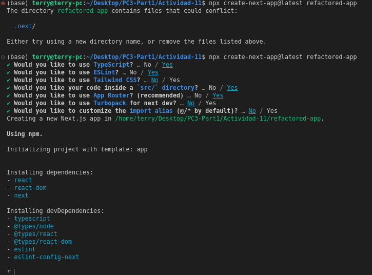
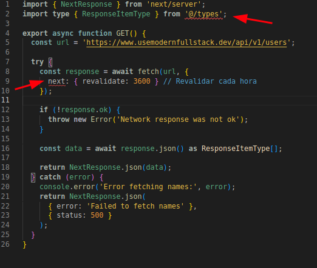
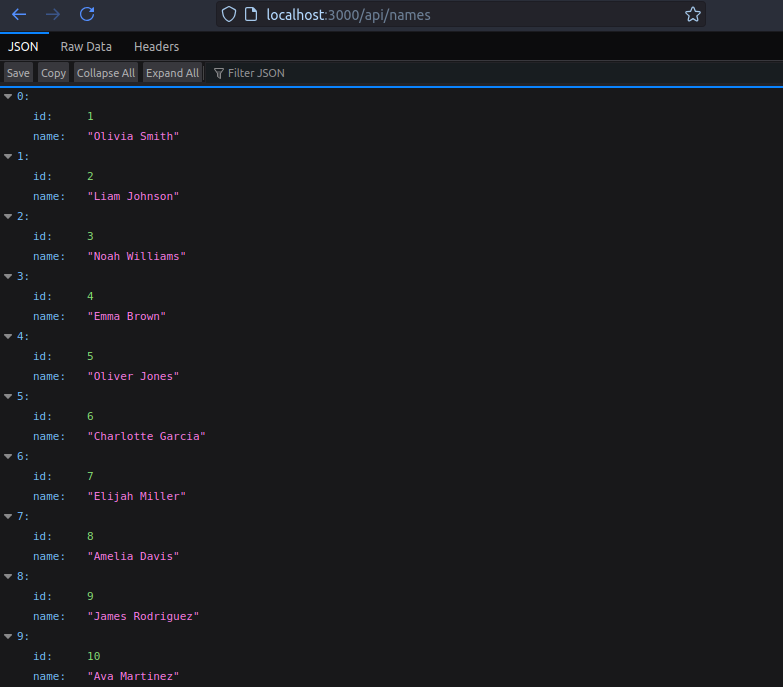
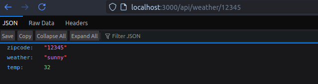
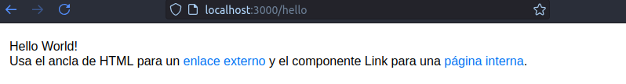
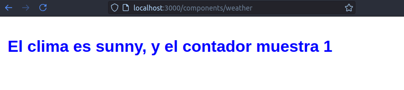

# Realizando la Actividad 11 :smiley:

Lo primero que realizamos para iniciar esta actividad es crear nuestra app Next.js, para realizar eso, puedo usar el siguiente comando

npx create-next-app@latest refactored-app

Nos saldrán varias opciones que podremos marcar Yes/No, en mi caso esa fue la configuración que utilicé:


Podemos notar que se crea nuestra carpeta refactored-app con varios archivos adentro, podemos agregar un archivo dentro de la carpeta api, esta carpeta ya existe dentro de src/pages/api. 

**Almacenando interfaces y tipos personalizados**

Creemos un archivo llamado index.ts en `src/types/index.ts`:


En este paso estamos creando nuestras interfaces y tipos personalizados, en este archivo pondremos lo siguiente:

```typescript
interface WeatherProps {
  weather: string;
}

type WeatherDetailType = {
  zipcode: string;
  weather: string;
  temp?: number;
};

type responseItemType = {
  id: string;
  name: string;
};
```
WeatherProp esta definiendo la estructura de las props que recibirá el componente Weather, este componente Weather solo necesita una propiedad weather de tipo STRING.
Usaremos la interfaz personalizada WeatherProps para el argumento props de la página que
muestra los componentes meteorológicos, components/weather. 


WeatherDetailType está definiendo la estructura de los datos del clima que devolverá la API, incluyendo código postal, clima y temperatura opcional.
El tipo WeatherDetailType es para
la ruta de API api/weather/:zipcode, que utiliza un código postal obtenido dinámicamente.


responseItemType esta definiendo la estructura de cada elemento en la respuesta de la API de nombres.
Usamos responseItemType en la ruta de API api/names para tipar la respuesta de la
obtención.

**Creando la primera ruta de API para los nombres**

Esta es una API route en Next.js que maneja peticiones a /api/names. Hace una petición a una API externa para obtener datos de usuarios y transforma los datos para solo devolver el id y nombre de cada usuario. 

Para realizar esto creamos un archivo llamado route.ts dentro de la carpeta api/names e interstamos el siguiente codigo:

```typescript
import { NextResponse } from 'next/server';
import type { ResponseItemType } from '@/types';

export async function GET() {
  const url = 'https://www.usemodernfullstack.dev/api/v1/users';

  try {
    const response = await fetch(url, {
      next: { revalidate: 3600 } // Revalidar cada hora
    });
    
    if (!response.ok) {
      throw new Error('Network response was not ok');
    }

    const data = await response.json() as ResponseItemType[];
    
    return NextResponse.json(data);
  } catch (error) {
    console.error('Error fetching names:', error);
    return NextResponse.json(
      { error: 'Failed to fetch names' },
      { status: 500 }
    );
  }
}
```


Si encuentras algun error, como los que yo tuve: 


Podemos ajustar el tsconfig.json:
En mi caso lo actualicé con:
```typescript
{
  "compilerOptions": {
    "target": "es5",
    "lib": ["dom", "dom.iterable", "esnext"],
    "allowJs": true,
    "skipLibCheck": true,
    "strict": true,
    "noEmit": true,
    "esModuleInterop": true,
    "module": "esnext",
    "moduleResolution": "bundler",
    "resolveJsonModule": true,
    "isolatedModules": true,
    "jsx": "preserve",
    "incremental": true,
    "plugins": [
      {
        "name": "next"
      }
    ],
    "paths": {
      "@/*": ["./src/*"]
    }
  },
  "include": ["next-env.d.ts", "**/*.ts", "**/*.tsx", ".next/types/**/*.ts"],
  "exclude": ["node_modules"]
}
```


**Creando la segunda ruta de API para el clima**

Esta es una API route dinámica que maneja peticiones a /api/weather/[zipcode]. El nombre del archivo [zipcode].ts indica que es una ruta dinámica en Next.js
Obtiene el código postal de los parámetros de la URL (req.query.zipcode)
Devuelve datos estáticos del clima

Para esto creamos una carpeta dentro de api/weather y dentro de esa carpeta el la carpeta: [zipcode].ts y adentro un archivo route.ts e insertamos el siguiente código:
```typescript
import { NextRequest, NextResponse } from 'next/server';
import type { WeatherDetailType } from '@/types';

export async function GET(
  request: NextRequest,
  { params }: { params: { zipcode: string } }
) {
  try {
    // Simulamos una llamada a API del clima
    const weatherData: WeatherDetailType = {
      zipcode: params.zipcode,
      weather: 'sunny',
      temp: Math.floor(Math.random() * 30) + 10 // Temperatura entre 10 y 40
    };

    return NextResponse.json(weatherData);
  } catch (error) {
    console.error('Error fetching weather data:', error);
    return NextResponse.json(
      { error: 'Failed to fetch weather data' },
      { status: 500 }
    );
  }
}
```

### Creación de Páginas

**Creando la página "Hello World"**

Crea una página dentro de la carpeta src/app/hello/ llamada page.tsx y escribe lo siguiente:
```typescript
'use client';

import React from 'react';
import Link from 'next/link';
import Image from 'next/image';

export default function Hello() {
  return (
    <div>
      <div>Hello World!</div>

      <div>
        Usa el ancla de HTML para un{' '}
        <a href="https://nostarch.com" target="_blank" rel="noopener noreferrer">
          enlace externo
        </a>{' '}
        y el componente Link para una{' '}
        <Link href="/components/weather">página interna</Link>.
      </div>

      <div>
        <Image src="/vercel.svg" alt="Vercel Logo" width={72} height={16} />
      </div>
    </div>
  );
}
```
**Creando la página del clima**

Ahora creemos esto: // src/app/components/weather/page.tsx
```typescript
'use client';

import React, { useState, useEffect } from 'react';
import type { WeatherProps } from '@/types';
import styles from './weather.module.css';

const WeatherComponent = (props: WeatherProps) => {
  const [count, setCount] = useState<number>(0);

  useEffect(() => {
    setCount(1);
  }, []);

  return (
    <h1 className={styles.heading} onClick={() => setCount(count + 1)}>
      El clima es {props.weather}, y el contador muestra {count}
    </h1>
  );
};

export default function Page() {
  return <WeatherComponent weather="sunny" />;
}
```
Asegura de tener configurado tsconfig.json:
```typescript
{
  "compilerOptions": {
    "target": "es5",
    "lib": ["dom", "dom.iterable", "esnext"],
    "allowJs": true,
    "skipLibCheck": true,
    "strict": true,
    "noEmit": true,
    "esModuleInterop": true,
    "module": "esnext",
    "moduleResolution": "bundler",
    "resolveJsonModule": true,
    "isolatedModules": true,
    "jsx": "preserve",
    "incremental": true,
    "plugins": [
      {
        "name": "next"
      }
    ],
    "paths": {
      "@/*": ["./src/*"]
    },
    "baseUrl": "."
  },
  "include": ["next-env.d.ts", "**/*.ts", "**/*.tsx", ".next/types/**/*.ts"],
  "exclude": ["node_modules"]
}
```

**Ahora si puedes agregar algunos estilos del componente weather:**

```css
/* src/app/components/weather/weather.module.css */
.heading {
  @apply text-2xl font-bold text-blue-600 cursor-pointer select-none
  hover:text-blue-800 transition-colors duration-200;
}
```

**Estilos Globales**

```css
/* src/app/globals.css */
/* Puedes agregar estilos globales aquí */
body {
  font-family: Arial, sans-serif;
  margin: 0;
  padding: 20px;
}

a {
  color: #0070f3;
  text-decoration: none;
}
```

**Configuremos el estilo del componente weather**
En:
src/app/components/weather/weather.module.css
```css
.heading {
  color: blue;
  cursor: pointer;
  user-select: none;
}
```

Para poder aplicarlo en el componente:
En src/app/components/weather/page.tsx:

```typescript
'use client';

import React, { useState, useEffect } from 'react';
import type { WeatherProps } from '@/types';
import styles from './weather.module.css';

const WeatherComponent = (props: WeatherProps) => {
  const [count, setCount] = useState<number>(0);

  useEffect(() => {
    setCount(1);
  }, []);

  return (
    <h1 className={styles.heading} onClick={() => setCount(count + 1)}>
      El clima es {props.weather}, y el contador muestra {count}
    </h1>
  );
};

export default function Page() {
  return <WeatherComponent weather="sunny" />;
}

```

Antes de probar, vayamos a next.config.ts para poder configurar las nuevas rutas:

```typescript
/** @type {import('next').NextConfig} */
const nextConfig = {
  reactStrictMode: true,
};

export default nextConfig;

```


**Probando**

1. Inicias el servidor de desarrollo:
```
npm run dev
```

Verifica tus rutas de API:

    http://localhost:3000/api/names
    http://localhost:3000/api/weather/12345

Visita las paginas:

    http://localhost:3000/hello
    http://localhost:3000/components/weather


A mi me salió lo siguiente:
Para http://localhost:3000/api/names:



Para http://localhost:3000/api/weather/12345


Para http://localhost:3000/hello:


Para http://localhost:3000/components/weather

