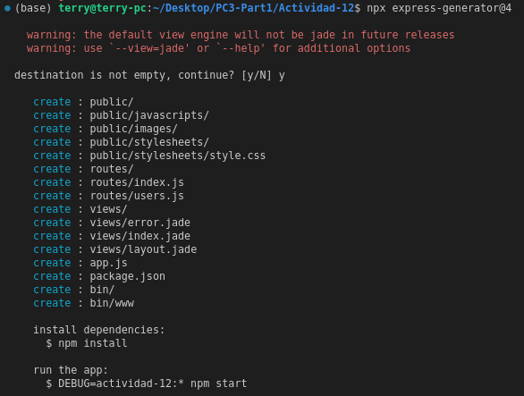
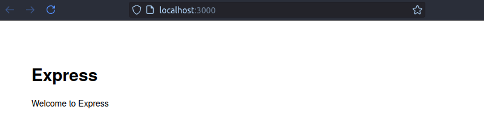
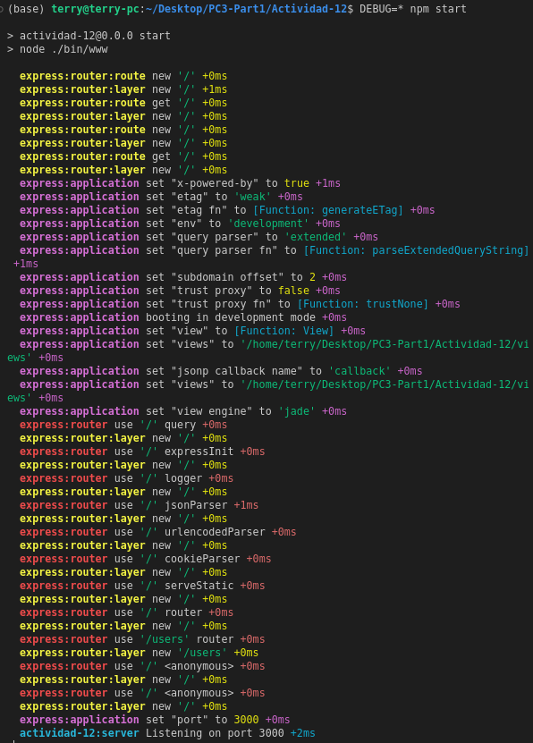
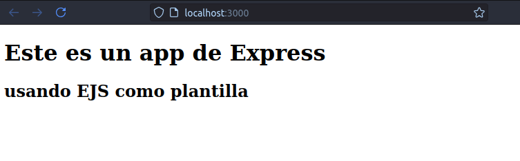
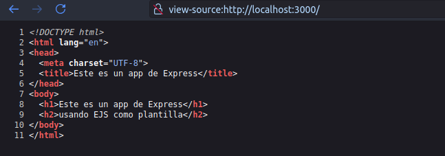

## Usando el generador para crear app básica de express

```npx express-generator@4```




Para instalar dependencias seguimos con: 
```npm install```

Para iniciar la app:
```npm start```

Ingreso a (http://localhost:3000/) y logro ver lo siguiente:



Podamos iniciar tambien la app con el comando 

```DEBUG=* npm start```

y podemos ver una salida detallada:



## Renderizando una plantilla

Creamos en otra carpeta nueva, la mia es llamada helloWorldLittleApp, ahi escribimos el siguiente comando

```npm install express@4```

Vemos que se crean carpetas, nosotro en la raiz agregamos un archivo llamado helloWorldTemplate.js con lo siguiente:
```typescript
import express from 'express';

const app = express();
const port = 3000;

// Configurar el motor de plantillas EJS
app.set('view engine', 'ejs');

// Ruta para renderizar la plantilla
app.get('/', (req, res) => {
  res.render('index', {
    title: 'Este es un app de Express',
    subtitle: 'usando EJS como plantilla'
  });
});

// Iniciar el servidor
app.listen(port, () => {
  console.log(`App corriendo en http://localhost:${port}`);
});
```

Ahora, creemos una carpeta llamada views en la raíz del proyecto. Dentro de esta carpeta creamos el archivo index.ejs:
```html
<!DOCTYPE html>
<html lang="en">
<head>
  <meta charset="UTF-8">
  <title><%= title %></title>
</head>
<body>
  <h1><%= title %></h1>
  <h2><%= subtitle %></h2>
</body>
</html>
```
No olvidemos tener instalado ejs con:

```npm install ejs```


Y listo!! Podemos verlo:



Si accedemos a:

```view-source:http://localhost:3000/```

Podemos mirar:
