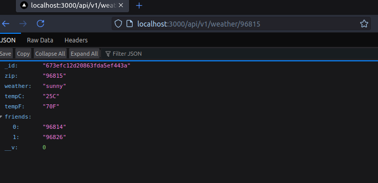
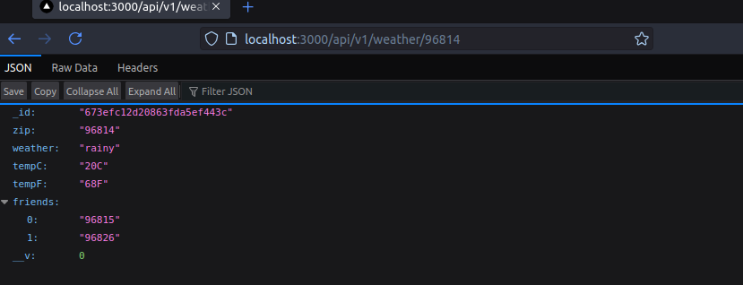

# Creación de una API del Clima con Next.js, MongoDB y TypeScript

## Introducción

Vamos a transformar nuestra API REST estática en una aplicación con base de datos real utilizando MongoDB en memoria. 

## Requisitos Previos

Para comenzar, necesitamos instalar algunas dependencias. En el directorio raíz de nuestra aplicación Next.js, ejecutamos:

```bash
npm install mongodb-memory-server mongoose
```

## Estructura del Proyecto

Primero, creamos dos carpetas:
- `mongoose/weather/`: Contendrá todo lo relacionado con nuestro modelo de datos
- `middleware/`: Contendrá la lógica de conexión a la base de datos

## Paso 1: Definiendo la Interfaz

Lo primero que necesitamos es definir la estructura de nuestros datos. En TypeScript, usamos interfaces para esto. Creamos el archivo `mongoose/weather/interface.ts`:

```typescript
export interface WeatherInterface {
    zip: string;
    weather: string;
    tempC: string;
    tempF: string;
    friends: string[];
}
```

Esta interfaz define exactamente cómo se verán nuestros datos del clima. 
## Paso 2: Creando el Esquema

El esquema es la parte que le dice a MongoDB cómo debe estructurar nuestros datos. En `mongoose/weather/schema.ts`:

```typescript
import { Schema } from "mongoose";
import { WeatherInterface } from "./interface";

export const WeatherSchema = new Schema<WeatherInterface>({
    zip: {
        type: String,
        required: true,
    },
    weather: {
        type: String,
        required: true,
    },
    tempC: {
        type: String,
        required: true,
    },
    tempF: {
        type: String,
        required: true,
    },
    friends: {
        type: [String],
        required: true,
    },
});
```

El esquema es como un plano que define la estructura de los datos y sus restricciones. Aquí decimos que todos los campos son obligatorios usando `required: true`.

## Paso 3: Creando el Modelo

El modelo es la interfaz que usaremos para interactuar con la base de datos. En `mongoose/weather/model.ts`:

```typescript
import mongoose from "mongoose";
import { WeatherInterface } from "./interface";
import { WeatherSchema } from "./schema";

const WeatherModel = mongoose.models.Weather || 
    mongoose.model<WeatherInterface>("Weather", WeatherSchema);

export default WeatherModel;
```

El modelo combina nuestra interfaz y esquema, y nos da los métodos para interactuar con la base de datos.NOtemos que el patrón `mongoose.models.Weather || mongoose.model()` que evita crear múltiples modelos en desarrollo.

## Paso 4: Creando los Servicios CRUD

Los servicios son funciones que nos permiten interactuar con la base de datos. En `mongoose/weather/services.ts`:

```typescript
import WeatherModel from "./model";
import { WeatherInterface } from "./interface";

// Crear (Create)
export async function storeDocument(doc: WeatherInterface): Promise<boolean> {
    try {
        const newDocument = new WeatherModel(doc);
        await newDocument.save();
        return true;
    } catch (error) {
        console.error('Error storing weather document:', error);
        return false;
    }
}

// Leer (Read)
export async function findByZip(zip: string): Promise<WeatherInterface | null> {
    try {
        const result = await WeatherModel.findOne({ zip }).lean();
        return result;
    } catch (error) {
        console.error('Error finding weather document:', error);
        return null;
    }
}

// Actualizar (Update)
export async function updateByZip(
    zip: string,
    newData: Partial<WeatherInterface>
): Promise<boolean> {
    try {
        const result = await WeatherModel.updateOne(
            { zip },
            { $set: newData }
        );
        return result.modifiedCount > 0;
    } catch (error) {
        console.error('Error updating weather document:', error);
        return false;
    }
}

// Eliminar (Delete)
export async function deleteByZip(zip: string): Promise<boolean> {
    try {
        const result = await WeatherModel.deleteOne({ zip });
        return result.deletedCount > 0;
    } catch (error) {
        console.error('Error deleting weather document:', error);
        return false;
    }
}
```

Estas funciones implementan las operaciones CRUD (Create, Read, Update, Delete) básicas que necesitamos para manejar nuestros datos.

## Paso 5: Configurando la Conexión a la Base de Datos

El middleware de conexión es crucial para mantener una conexión estable con la base de datos. En `middleware/db-connect.ts`:

```typescript
import mongoose from "mongoose";
import { MongoMemoryServer } from "mongodb-memory-server";
import { storeDocument } from "../mongoose/weather/services";

let mongoServer: MongoMemoryServer | null = null;

async function dbConnect(): Promise<void> {
    try {
        if (mongoose.connection.readyState === 1) {
            return;
        }

        if (!mongoServer) {
            mongoServer = await MongoMemoryServer.create();
            const MONGODB_URI = mongoServer.getUri();

            await mongoose.connect(MONGODB_URI, {
                dbName: "Weather"
            });

            // Datos iniciales solo si la colección está vacía
            const collections = await mongoose.connection.db.listCollections().toArray();
            if (!collections.find(c => c.name === 'weathers')) {
                await storeDocument({
                    zip: "96815",
                    weather: "sunny",
                    tempC: "25C",
                    tempF: "70F",
                    friends: ["96814", "96826"]
                });
                // ... más datos iniciales ...
            }
        }
    } catch (error) {
        console.error("Database connection error:", error);
        throw error;
    }
}

export default dbConnect;
```

## Paso 6: Implementando el Endpoint de la API

Finalmente, modificamos nuestro endpoint para usar la base de datos. En `pages/api/v1/weather/[zipcode].ts`:

```typescript
import type { NextApiRequest, NextApiResponse } from "next";
import { findByZip } from "../../../../mongoose/weather/services";
import dbConnect from "../../../../middleware/db-connect";

export default async function handler(
    req: NextApiRequest,
    res: NextApiResponse
): Promise<void> {
    try {
        await dbConnect();
        const zip = req.query.zipcode as string;
        
        const data = await findByZip(zip);
        
        if (data) {
            res.status(200).json(data);
        } else {
            res.status(404).json({ 
                message: "Weather data not found" 
            });
        }
    } catch (error) {
        res.status(500).json({ 
            message: "Internal server error"
        });
    }
}
```

Ahora miremos lo que obtenemos si ingresamos a los siguiente:

/api/v1/weather/96815 

/api/v1/weather/96814 

/api/v1/weather/96826 


Listo :smile: