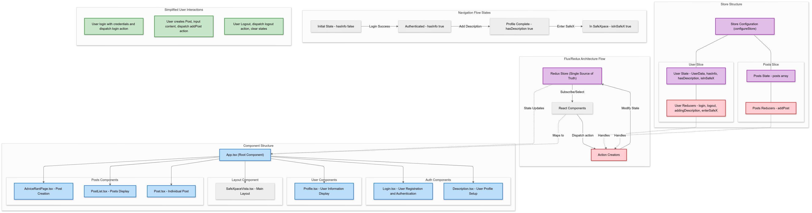

# safeXpace
Mi proyecto se llama safeXpace, es un aplicativo hecho en React.
Este es un tutorial que puedes seguir para recrearlo y aprender Redux, types/interfaces y algunos Hooks
- Usado en el proyecto: https://redux.js.org/tutorials/fundamentals/part-1-overview


### REQ1-Diseñar la arquitectura front-end siguiendo los principios de ingeniería de software y  REQ5-Documentar las decisiones arquitectónicas y los patrones utilizados.


(Hecho con Mermaid)

SafeXpace implementa un flujo de usuario secuencial basado en estados en Redux. El flujo inicia con un componente de autenticación (Login.tsx) que captura la información del usuario mediante un formulario controlado con useState. Al disparar la acción login a través de dispatch, el estado hasInfo se actualiza a true en el userSlice.

La navegación progresa cuando hasInfo es true, renderizando el componente Description.tsx que permite al usuario ingresar su descripción. Al completar este paso, se despacha la acción addingDescription que actualiza hasDescription a true. Posteriormente, se renderiza Profile.tsx, un componente presentacional que muestra los datos almacenados en el estado global user.value. Al hacer click en "enter SafeXpace", se despacha enterSafeX actualizando isInSafeX a true.

En la vista principal (SafeXpaceVista.tsx), se implementa un componente de header con la información del usuario y la funcionalidad de logout. El componente AdviceRantPage.tsx contiene un formulario controlado que permite crear posts de tipo "Rant" o "Ask4advice", despachando la acción addPost al postsSlice. Cada post se renderiza a través del componente presentacional Post.tsx, que recibe las props tipadas mediante una interface PostProps.

La arquitectura actual implementa patrones y principios básicos ya que hasta el momento es un aplicativo pequeño. Podriamos decir que la arquitectura frontend actualmente se basa en: El conjunto del patrón arquitectónico Flux implementado a través de Redux, donde el estado global actúa como single source of truth, y La estructura de componentes de modelo jerárquico React basado en la composición, donde hay pequeños rasgos de la implementación del principio de responsabilidad única (SRP), ya que cada componente tiene una función específica: Login.tsx maneja autenticación, Profile.tsx visualización de datos, Description.tsx actualización de perfil. Pero eso puede mejorar, por eso menciono que solamente hay un indicio del uso de SRP.

Hasta el momento, los principios de diseño implementados incluyen:

- Composición de componentes: Construimos UIs complejas componiendo componentes más pequeños
- Inmutabilidad a través de Redux Toolkit, facilitando el tracking de cambios de estado
- Unidirectional Data Flow: Los datos fluyen desde componentes hacia el store mediante dispatch(action) y del store a los componentes vía useSelector

La arquitectura es escalable para incorporar necesidades como:

- Routing con React Router
- Comunicación con backend mediante servicios API
- Manejo de estado asíncrono con middleware como Redux Thunk
- Testing unitario de reducers y componentes


La arquitectura frontend actual es una combinación de:

- Modelo de componentes React jerárquico
- Gestión de estado centralizada con Redux
- Navegación basada en estados
- Principio de Responsabilidad Única parcialmente implementado
- Patrones de diseño básicos de React como la composición de componentes

Esta base arquitectónica me puede permitir escalar el aplicativo y agregando patrones adicionales según crezcan los requerimientos.


### REQ2 : Implementar componentes funcionales y Hooks Avanzados

Mencionaré todos los componentes funcionales que tenemos en nuestro aplicativo y los Hooks avanzados que usamos en estos componentes:

`Login.tsx` es un componente funcional que maneja el registro inicial de usuario. Este componente utiliza:
- `useState` para manejar el estado local del formulario:
```typescript
const [name, setName] = useState<string>("")
const [age, setAge] = useState<number>(0)
const [email, setEmail] = useState<string>("")
```
- `useDispatch` para despachar la acción `login` al store:
```typescript
const dispatch = useDispatch()
dispatch(login({name, age, email, description: ""}))
```
El componente maneja el submit del form con `handleInputChange` que previene el default event con `e.preventDefault()`.

`Description.tsx` maneja la adición de descripción al usuario. Implementa:
- `useState` para el control del input:
```typescript
const [newDescription, setNewDescription] = useState<string>("")
```
- `useSelector` para obtener el nombre del usuario del store:
```typescript
const user = useSelector((state:RootState)=> state.user.value)
```
- `useDispatch` para la acción `addingDescription`
El componente muestra el nombre actual y permite agregar descripción.

`Profile.tsx` es un componente de visualización que utiliza:
- `useSelector` para obtener toda la data del usuario y mostrarla
```typescript
const user = useSelector((state: RootState) => state.user.value)
```
- `useDispatch` para la acción `enterSafeX`
Muestra name, age y description del usuario.

`SafeXpaceVista.tsx` es el layout principal que implementa:
- `useSelector` para mostrar datos del usuario y el boton de logout
```typescript
const user = useSelector((state: RootState) => state.user.value)
```
- `useDispatch` para manejar el logout
Renderiza el header con datos del usuario y el botón de logout.

`AdviceRantPage.tsx` maneja la creación de posts:
- `useState` para el contenido del post:
```typescript
const [postContent, setPostContent] = useState("")
```
- `useSelector` para data del usuario actual:
```typescript
const user = useSelector((state: RootState) => state.user)
```
- `useDispatch` para despachar `addPost`
Tiene dos botones que determinan el tipo de post a crear.

`PostList.tsx` es un componente de renderizado que usa:
- `useSelector` para obtener el array de posts:
```typescript
const posts = useSelector((state: RootState) => state.posts.posts)
```
Mapea los posts y renderiza el componente `Post` para cada uno.

`Post.tsx` es un componente puramente presentacional:
- No utiliza hooks
- Recibe props tipadas:
```typescript
interface PostProps {
    postType: string
    name: string
    age: number
    content: string
}
```

El manejo de estado local se hace principalmente con `useState` en componentes de formulario (`Login`, `Description`, `AdviceRantPage`). La conexión con Redux se maneja a través de `useSelector` para leer estado y `useDispatch` para acciones. 


### REQ3: Aplicar tipado estricto con TypeScript en todo el proyecto

### REQ4: Escribir pruebas unitarias para componentes y lógica de negocios usando Jest y React Testing Library


# Tutorial de implementación 
### Paso 1 : Initial Setup 

Creamos nuestro app con el comando:
``` typescript
npx create-react-app my-app --template typescript
```
Y en el mismo directorio del proyecto, si quieres correr el app, usas:
``` typescript
npm start
```
Instalemos todas nuestras dependencias y paquetes que usaremos, en este caso usaremos:
``` typescript
npm install react-redux @reduxjs/toolkit
```
Nosotros deseamos primero crear lo más simple de nuestra aplicación que sería crear dos componentes:
- Un componente será el login.tsx : Este componente permite al usuario que cree su cuenta o "registre su informacion"
- Otro componente será el profile.tsx: Este componente muestra esa información.

Para esto, podemos crear un folder llamado components y ahí crear los dos archivos tsx:
En el login quiero crear un botón por el momento, porque tengo la idea de luego crear un tipo formulario.

``` typescript
import React from "react";

function Login() {
    return (
        <div>
            <button>Login</button>
        </div>
    );
}

export default Login;
```

En el componente profile, podemos crear el texto que queremos que luego se muestre, pero hagamoslo como un tipo template por el momento

``` typescript
import React from "react";

function Profile() {
    return (
        <div>
            <h1>Profile</h1>
            <p> Name: </p>
            <p> Age: </p>
            <p> Email: </p>
        </div>
    );
}

export default Profile;
```

Ahora para poder mostrar estos componentes en http://localhost:3000/ debemos modificar nuestro App.tsx que no está renderizando los componentes que acabamos de crear.

``` typescript
import Profile from './components/profile'
import Login from './components/login';

function App() {
  return (
    <div className='app'> // es nuestro padre
      <Profile /> // child
      <Login /> // child
    </div>
  );
}

export default App;

```

Hasta el momento, si haces click en el botón Login, no pasará nada, la información de Profile no cambia sus valores, eso es lo siguiente que queremos hacer

### Paso 2 : Implementando Redux

Abramos index.tsx que es  donde se llama a App y se renderiza App.
En Redux existe algo llamado Store, que es como un contenedor que contiene informacion, en caso de Redux, es un store que contiene todos los States que queremos hacer global. Es decir, todos los States que queremos que se accedan a traves de toda la app y que tambien querramos que esten disponibles para cambiarlos.
Entonces, creemos nuestro store.

Primero debemos importar nuestro configureStore function, es una funcion de @reduxjs/toolkit que me permite crear un store de forma sencilla.
``` typescript
import {configureStore} from "@reduxjs/toolkit";
```
Luego creamos nuestra constante store que la igualamos a la funcion configureStore y dentro de esta funcion le pasamos parametros, que en este caso, serán una colección de reducers. Todos los reducers que usaremos en nuestro app deberian estar acá.
``` typescript
const store = configureStore({
    reducer:{}
})
```

Luego importamos nuestro Provider, con esto especificamos, que componentes tendran acceso a nuestro store. 

``` typescript
import {Provider} from "react-redux"; 
```

En nuestro caso queremos que todos nuestro componentes tengan acceso al store
Todo lo que esté dentro de nuestro Provider, que en nuestro caso es, todo lo que este dentro de App, tendrá acceso a nuestro store.
``` typescript
root.render(
  <React.StrictMode>
    <Provider store={store}> 
      <App />
    </Provider>
  </React.StrictMode>
);
```

Retrocedamos nuevamente a reducer, un reducer es simplemente una funcion, que agarra cierto value del estado actual y una accion de lo que queremos hacer con ese value y RETORNA un nuevo value para ese state. Y con ese cambio tendriamos nuestro nuevo state. Tendremos reducers para todos los tipos de estados que queremos generar en nuestra aplicacion.

Pensemos de esta manera, tenemos dos componentes principales, Login y Profile. Para esta aplicación, necesitamos definir un estado global llamado user. Este estado inicial estará vacío o con valores predeterminados, pero cuando el usuario interactúe con el componente Login e introduzca su información (nombre, edad, correo electrónico), esa información debe actualizar el estado user.

El flujo sería el siguiente: al hacer clic en el botón de login en el componente Login, los valores ingresados se almacenan en el estado user en nuestro store de Redux. Así, el estado inicial de user (que estaba vacío) se actualiza con los nuevos datos del usuario.

Una vez que el estado user se actualiza, el componente Profile, que está suscrito a este estado, detecta automáticamente el cambio. Como resultado, Profile se renderiza de nuevo para mostrar la información actualizada del usuario sin necesidad de pasar datos de Login a Profile manualmente.


Si lo que queremos es tener nuestro user state, tambien debemos crear nuestro user reducer, asi que creemos un nuevo folder, llamado features y ahi un file llamado user.tsx

En este archivo, importemos createSlice, que es una forma simple de crear reducers:

``` typescript
import { createSlice } from "@reduxjs/toolkit"; 
```

Ahora vamos a crear nuestro userSlice, que será una constante (const userSlice = createSlice(...)). Este slice contendrá toda la información necesaria para gestionar el estado user, incluyendo:

- El nombre del slice, que será el mismo nombre que el del estado (user).
- El valor inicial del estado.
- Las funciones reductoras (reducers), que son las acciones que modifican el estado.

Para definir el valor inicial, primero creamos una constante llamada initialStateValue, que contendrá un usuario con sus valores vacíos (nombre, edad, correo electrónico en blanco). Así:

``` typescript
const initialStateValue = {name: "", age: 0 , email: ""}
```

Este valor se usará como el initialState para nuestro userSlice. Dentro de initialState, definimos una propiedad value y la asignamos a initialStateValue. Esto nos permitirá acceder a value dentro del estado de user.
``` typescript
export const userSlice = createSlice({
    name: "user",
    initialState: { value: initialStateValue},
});
```
Una vez que tenemos el valor inicial y el nombre, también definimos las funciones reductoras (reducers) dentro del slice. Cada reducer será una función que altera el estado value en función de las acciones que se despachen (por ejemplo, una acción login para actualizar el estado con los valores ingresados por el usuario).

Definiendo Reducers Automáticamente

Dentro de reducers, defines funciones para manejar cambios específicos en el estado. Estas funciones dentro de reducers son reductoras (reducers) que modifican el estado en función de la acción recibida.

Cada clave en reducers (como login y logout) se convierte en el nombre de una acción y se asocia con una función reductora que describe cómo debe cambiar el estado cuando esa acción se despacha.

Nota importante que luego tendra mas sentido: createSlice crea automáticamente un reducer principal para el slice que maneja estas acciones.

``` typescript
export const userSlice = createSlice({
    name: "user",
    initialState: { value: initialStateValue},
    reducers:{}
});  
```
Nuestra primera función reductora será login, que toma dos argumentos: el estado actual (state) y una acción (action). La acción es un objeto que contiene información sobre el cambio que queremos realizar en el estado.

Dentro de la acción, tenemos dos propiedades principales:

- type: Este indica el tipo de acción que se está realizando. Esencialmente, type describe la intención de la acción. Aunque en este caso no necesitamos usar type directamente dentro del reducer (Redux Toolkit lo maneja internamente), es una parte fundamental de la acción para saber qué está ocurriendo en el flujo de Redux.

- payload: Esta es la información o datos que se usan para modificar el estado. En nuestro caso, payload es un objeto que contiene los nuevos valores del usuario (por ejemplo, name, age, y email). Cuando llamamos a la función login, pasamos este payload con los valores que queremos establecer en el estado.

La función login se escribe como un reducer que:

- Toma el estado actual (state).
- Reemplaza el value del estado con los datos proporcionados en action.payload.

La otra funcion que creamos es la de logout, que hace lo mismo que login solamente que ahora lo unico que hace es actualizar el estado con initialStateValue.

``` typescript
export const userSlice = createSlice({
    name: "user",
    initialState: { value: initialStateValue},
    reducers:{
        login: (state, action) => {
            state.value = action.payload;
        },

        logout: (state) => {
            state.value = initialStateValue;
        }
    }, // everything inside this slice
});

```

Ahora exportamos el reducer generado automáticamente por createSlice:

``` typescript
export default userSlice.reducer
```

En el archivo index.tsx, importamos el reducer exportado de userSlice y lo llamamos userReducer. Esto es solo una convención de nombre para referirnos al reductor de user:
``` typescript
import userReducer from "./features/user"
```

y luego añadimos esto que hace dos cosas:

Declarando que existe un estado user:

- Al escribir user: userReducer, estás creando una "porción" de estado global (llamada user) que estará disponible en el store de Redux.

Especificando que userReducer maneja los cambios en el estado user:
- userReducer contiene toda la lógica para manejar acciones como login y logout que afectan al estado user.
- Cuando se despachan acciones relacionadas con user, Redux sabe que debe usar userReducer para determinar cómo actualizar ese estado.
  
``` typescript
const store = configureStore({
  reducer: {
    user:userReducer,
  }
})
```

### Paso 3 : Usando useSelector hook

Usamos useSelector hook de react-redux para leer datos directamente del estado global de redux dentro de un componente de react. 

``` typescript
import { useSelector } from "react-redux" 
```
Este hook toma una función de selección como argumento. Esta función recibe el estado global completo de Redux y te permite seleccionar (extraer) la parte específica del estado que necesitas en el componente.

(state: RootState):

- Este es el argumento de la función, que representa el estado global de Redux.
- Aquí estamos usando TypeScript, por lo que state: RootState significa que state es del tipo RootState.
- 
state.user.value:

- Esta es la expresión de retorno de la función.
- Aquí estamos especificando la parte exacta del estado global que queremos extraer: state.user.value.
- state.user es la porción del estado global llamada user, que configuramos en el store.
- value es una propiedad dentro de user (donde guardamos los datos del usuario, como nombre, edad, y email).

useSelector asigna lo que devuelve la función a la constante user

user contiene los datos del usuario que están almacenados en state.user.value.

``` typescript
const user = useSelector((state: RootState) => state.user.value)
```

Luego, mostramos user.name, user.age y user.email en el HTML.

``` typescript
function Profile(){
    const user = useSelector((state: RootState) => state.user.value)
    return (
        <div>
            <h1> Profile Page </h1>
            <p> Name: {user.name}</p> 
            <p> Age: {user.age}</p>
            <p> Email: {user.email}</p>
        </div>
    )
}
```

Continuemos recordemos que ya antes habiamos exportado en index.tsx nuestras acciones:
``` typescript
export const {login, logout} = userSlice.actions
```

### Paso 4 : Usando useDispatch hook
Queremos que el componente Login permita al usuario ingresar su información en un formulario. Cuando el usuario presiona el botón para enviar el formulario, actualizamos el estado global user con esta información.

Primero, necesitamos importar el hook useDispatch de react-redux y la acción login que hemos definido en nuestro userSlice.
``` typescript
import { login } from "../features/user"; // Importa la acción `login` del slice `user`
```

Dentro del componente Login, definimos dispatch, estamos creando una instancia de la función dispatch que ya está lista para usarse en cualquier lugar dentro de este componente. Esto hace que dispatch esté disponible en todo el componente Login y se pueda reutilizar en múltiples lugares si es necesario

useDispatch() nos da acceso a dispatch, la función de envío de Redux, que usamos para despachar acciones.

``` typescript
const dispatch =  useDispatch();
```

Luego creamos nuestra funcion handleInputChange, en el cual recibimos como argumento ... y retorna primera que la pagina no se actulaice y despues lo que hace es llamar a la funcion dispatch, estamos usando la constante dispatch que definimos antes pra despachar la accion login

login({...}) es una función que hemos importado de userSlice, y cuando la llamamos, genera una acción con un tipo específico (user/login) y un payload (el contenido de {...}).

Al hacer dispatch(login({...})), estamos enviando esta acción al store de Redux, que actualizará el estado user con los datos nuevos que ingresamos
``` typescript

    const dispatch =  useDispatch();
    const handleInputChange = (e: React.FormEvent) => {
        e.preventDefault();

        dispatch(login({
            name:name,
            age:age,
            email:email
        }));
    };

```

Luego definimos estados locales para manejar los valores del formulario (name, age, y email) en el componente Login:

Definir name con useState:

``` typescript
const [name, setName] = useState<string>("");
```
- name: Es la variable que almacena el valor actual del campo de nombre.
- setName: Es la función que actualiza el valor de name.
- useState<string>(""): Inicializa name como una cadena vacía (""), lo que indica que el valor inicial del campo de nombre es vacío. Especificamos el tipo <string> para que TypeScript sepa que name debe ser siempre una cadena de texto.


Definir age con useState


``` typescript
const [age, setAge] = useState<number>(0);

```
- age: Es la variable que almacena el valor actual del campo de edad.
- setAge: Es la función que actualiza el valor de age.
- useState<number>(0): Inicializa age como 0, y el tipo <number> asegura que age siempre sea un número. Esto es útil para el campo de edad, donde queremos evitar valores no numéricos.
Definir email con useState:
``` typescript
const [email, setEmail] = useState<string>("");
```

- email: Es la variable que almacena el valor actual del campo de email.
- setEmail: Es la función que actualiza el valor de email.
- useState<string>(""): Inicializa email como una cadena vacía (""). Usamos <string> para que TypeScript verifique que email siempre sea de tipo cadena.

Continuemos con lo que renderizará el componente, todo esto va dentro de return:
Primero escribimos
``` typescript
<form onSubmit={handleInputChange}>
```
- <form>: Define el formulario HTML, que agrupa los campos de entrada y el botón.
- onSubmit: Este evento se dispara cuando el formulario se envía, ya sea al hacer clic en el botón de enviar o al presionar "Enter" en cualquier campo del formulario.
     - handleInputChange: Aquí handleInputChange es la función que queremos ejecutar cuando se envía el formulario.
     - La función handleInputChange manejará el envío y se asegurará de que se despache la acción login para actualizar el estado global en Redux.

Analicemos bien con un campo de entrada para el nombre, luego todos los demas siguen la misma logica :
``` typescript
    return (<div>                     
        <form onSubmit={handleInputChange}>
            <input
                type="text"
                name="name"
                value={name}
                onChange={(e)=>setName(e.target.value)}
                placeholder="i am ..."
            />
```

- type="text": Especifica que el campo acepta texto.
- name="name": Asigna un nombre al campo, útil si deseas identificar el input de alguna forma en la función handleInputChange.
- value={name}: Vincula el valor del input al estado local name. Esto convierte el campo en un componente controlado, donde el valor del input refleja el estado local name.
- onChange={(e) => setName(e.target.value)}:

    - onChange: Es un evento que se dispara cada vez que el usuario escribe en el input.
    - setName(e.target.value): Llama a setName, pasando el nuevo valor del input (e.target.value). Esto actualiza el estado name con cada tecla que el usuario escribe, manteniendo el estado sincronizado con el campo.
    - e.target.value: e es el evento, y target.value representa el valor actual del campo de texto.
Luego se realiza lo mismo con todo lo demas:
``` typescript
   return (<div>                     
        <form onSubmit={handleInputChange}>
            <input
                type="text"
                name="name"
                value={name}
                onChange={(e)=>setName(e.target.value)}
                placeholder="i am ..."
            />
            <input
                type="string"
                name="age"
                value={age}
                onChange={(e)=>setAge(Number(e.target.value))}
                placeholder="my age is ..."
            />
            <input
                type="text"
                name="email"
                value={email}
                onChange={(e)=> setEmail(e.target.value)}
                placeholder="my email is..."
            />

            <button type= "submit"> Login </button>
        </form>
    </div>)
}
```
