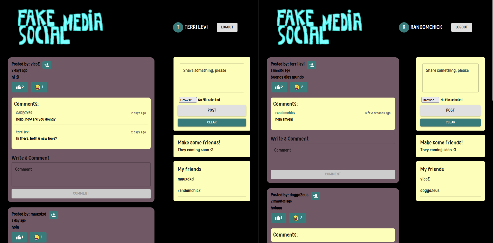
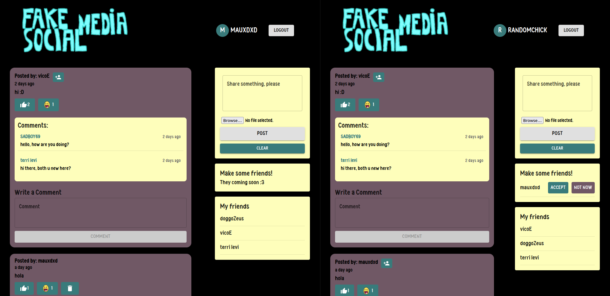

# Entregable 2 - añádiendo socket.io y comentarios:
#### Fotitos:



# Setup del entorno para poder correr la aplicación con docker

### Requisitos Previos

- **Docker** y **Docker Compose** instalados en su sistema.
- **Node.js** y **npm** si desea ejecutar la aplicación sin Docker.

### Clonar el Repositorio

```bash
git clone https://github.com/terrilevi/C8288-Desarrollo-de-Sistemas-Web/tree/main/finalProject.git
```

### Configuración de Variables de Entorno

Crear un archivo `.env` en el directorio `server/` con el siguiente contenido:

```env
PORT=5000
MONGODB_URI=tu_uri_de_mongodb
JWT_SECRET=tu_secreto_jwt
```

**Nota**: Reemplaza `tu_uri_de_mongodb` y `tu_secreto_jwt` con tus credenciales reales.

---

## Uso de Docker

La aplicación está preparada para ser ejecutada en contenedores Docker utilizando Docker Compose.

### Requisitos Previos

- **Docker** instalado en tu sistema.
- **Docker Compose** instalado (viene incluido con Docker en muchas instalaciones).

### Construcción de la Imagen Docker

Desde el directorio raíz del proyecto, ejecuta:

```bash
docker-compose build
```

Este comando construirá las imágenes Docker para el cliente y el servidor.

Nota: Yo tuve que usar sudo en linux.

### Ejecución de los Contenedores

Para iniciar los contenedores, ejecuta:

```bash
docker-compose up
```

Esto iniciará los servicios definidos en `docker-compose.yml`. La aplicación estará disponible en `http://localhost:3000`.

### Detener los Contenedores

Para detener los contenedores, presiona `Ctrl+C` en la terminal donde se está ejecutando `docker-compose up`, o ejecuta:

```bash
docker-compose down
```

---

# Implementación completa del desarrollo:
Me gustaria continuar explicando las nuevas fucnionalidades de mi proyecto,
antes que nada me gustaria hacer un refresh sobre como funcionaba mi aplicativo de forma general.


Veamos el caso de enviar una solicitud de amistad. Porque creo que será bueno para luego entender cómo es que añado la funcionalidad de socket.io.


Como primer inicio del flujo es que el usuario le da click en el botón de agregar amigo en un post:

```javascript
{user?.result?._id !== post?.creator && (
                <Button 
                  className={classes.friendButton}
                  onClick={handleFriendRequest}
                >
                  <PersonAddIcon fontSize="small" />
                </Button>
              )}
```

Esto llama a la función handleFriendRequest, y esta función lo unico que realiza es despachar la acción sendFriendRequest.
```javascript
// En components/Posts/Post/Post.js
const handleFriendRequest = () => {
    dispatch(sendFriendRequest(post.creator));
};
```
Y cuá es la acción de sendFriendRequest?
Esta acción es un action creator definida en actions/friends.js:
Anteriormente en mi entegable 1, pues era un código así:


```javascript
// Exportamos nuestro action creator asincrono llamado sendFriendRequest, que acepta userId, que
// es el ID del usuario de la persona que el usuario quiere agregar.
export const sendFriendRequest = (userId) => async (dispatch) => {
  // Dentro del bloque try se realiza un API call a api.sendFriendRequest(userId)
  // api.sendFriendRequest(userId) envia un POST request a /user/friend-request/:id
  // donde :id es userId
  try {
    const { data } = await api.sendFriendRequest(userId);
    // Despues, se despacha la accion SEND_FRIEND_REQUEST con la data recibida y si ocurre algun error
    // entonces se muestra en la consola el error.
    dispatch({ type: SEND_FRIEND_REQUEST, payload: data });
  } catch (error) {
    console.log('Error enviando un friendRequest: ', error);
    };
};
```

Ahora es así:

```javascript
export const sendFriendRequest = (userId) => async (dispatch) => {
  try {
      await api.sendFriendRequest(userId);
      // No realizamos un dispatch acá- Dejamos que Socket.IO maneje el update 
  } catch (error) {
      console.log('Error enviando un friendRequest: ', error);
  }
};
```

Antes de explicar por qué es que el código ha cambiado, sigamos con el flujo. 
Esta acción hace una llamada a nuestra API que está definida en api/index.js:

```javascript
export const sendFriendRequest = (userId) => API.post(`/user/friend-request/${userId}`);
```

Esta petición POST se enviará a nuestro servidor con el ID del usuario al que queremos enviar la solicitud. El token JWT que guardamos previamente en localStorage será incluido automáticamente en la petición gracias al interceptor de axios que configuramos.

En el servidor, la petición es recibida por las rutas en routes/users.js:

```javascript
router.post('/friend-request/:id', auth, sendFriendRequest);
```

Aquí podemos ver que:
- '/friend-request/:id' es nuestro endpoint
- auth es un middleware que verificará el token JWT antes de procesar la petición
- sendFriendRequest es el controlador que procesará la solicitud

El middleware auth verifica que:
- El token existe en los headers
- El token es válido y no ha expirado
- Extrae el ID del usuario que hace la petición y lo añade a req.userId

Si la autenticación es exitosa, la petición llega al controlador sendFriendRequest en controllers/user.js:

```javascript
// Controlador para enviar una solicitud de amistad
  export const sendFriendRequest = async (req, res) => {
    // Extraemos el ID del receptor de los parámetros de la URL usando destructuring
   // { id: receiverId } significa que tomamos el parámetro 'id' y lo renombramos a 'receiverId'
    const { id: receiverId } = req.params;
    
    try {
      // Verificamos si hay un usuario autenticado
      // req.userId existe solo si el middleware de auth validó el token
      if (!req.userId) {
        return res.status(401).json({ message: 'no autenticado' });
      }
      // Verificamos si se proporcionó un ID de receptor (evaluarlo luego, si lo elimino pq express tmb puede hacer esto)
      if (!receiverId) {
        return res.status(400).json({ message: 'el receiver id es requerido' });
      }
  
      // Verificamos que el usuario no esté intentando enviarse una solicitud a sí mismo
      // Comparamos el ID del remitente (req.userId) con el ID del receptor (receiverId)
      if (req.userId === receiverId) {
        return res.status(400).json({ message: "no puedes enviarte solicitudes a ti mismo xd" });
      }
  
      // Buscamos tanto al receptor como al remitente en la base de datos
      // Usamos await para esperar que MongoDB encuentre los usuarios
      const receiver = await User.findById(receiverId);
      const sender = await User.findById(req.userId);
      // Verificamos si el receptor existe
      if (!receiver) {
        return res.status(404).json({ message: "receptor no existe" });
      }
      // Verificamos si el remitente existe (evaluarlo luego, si lo elimino pq express tmb puede hacer esto)
      if (!sender) {
        return res.status(404).json({ message: "remitente no existe" });
      }
      
      // Verificamos si ya existe una solicitud de amistad
      // find busca en el array friendRequests un elemento que cumpla la condición
     // String() convierte los ObjectId a string para poder compararlos
      const existingRequest = receiver.friendRequests.find(
        request => String(request.from) === String(req.userId)
      );
      // Si ya existe una solicitud, retornamos un error
      if (existingRequest) {
        return res.status(400).json({ message: "ya se envio una solicitud de amistad" });
      }
        
      // Verificamos si ya son amigos
     // includes verifica si el ID del remitente está en el array de amigos del receptor
      if (receiver.friends.includes(req.userId)) {
        return res.status(400).json({ message: "los usuarios son amigos" });
      }
      
     // Si pasamos todas las verificaciones, añadimos la solicitud
     // push añade un nuevo elemento al array friendRequests
     // { from: req.userId } es el objeto que representa la solicitud
      receiver.friendRequests.push({ from: req.userId });
     // Guardamos los cambios en la base de datos
     // save() es un método de Mongoose que actualiza el documento      
      await receiver.save();
      
      res.status(200).json({ message: "solicitud de amistad enviada correctamente" }); // Enviamos una respuesta exitosa
    } catch (error) {
      res.status(500).json({ message: error.message });
    }
  };
```

Este controlador realiza varias verificaciones:
1. Confirma que el usuario está autenticado
2. Verifica que no se envíe una solicitud a uno mismo
3. Comprueba que ambos usuarios existen en la base de datos
4. Verifica que no exista una solicitud previa
5. Comprueba que los usuarios no sean ya amigos
6. Si todo está bien, añade la solicitud a la lista de solicitudes pendientes del receptor

Cuando la respuesta exitosa vuelve al cliente, la acción creator sendFriendRequest que estaba esperando la respuesta a la llamada api , despacha SEND_FRIEND_REQUEST con los datos:

```javascript
dispatch({ type: SEND_FRIEND_REQUEST, payload: data });
```

Este dispatch actualiza el estado en el reducer de friends, de hecho para esta accion, no hemos creado un reducer, pues solamente necesitamos que se añada en la base de datos en el array de friendRequests del usuario receptor,. 
Pero el receptor no recibe ninguna notificacion inmediata de solicitud, su aplicacion cliente no tiene conocimiento de este cambio hasta que se realiza una nueva peticion al servidor. Para que entonces el usuario receptor pueda ver sus solicitudes nuevas, debe refrescar la pagina o realizar alguna accion que desencadene una actualizacion de datos.
En palabras tenicas, el flujo actual es sincrono y depende depeticiones iniciadas por el cliente (pull) en luagr de actulaizacion enviadas por el servidor. 

### Entonces aqui es cuando recien llega nuestra pregunta: ¿CÓMO IMPLEMENTO ACTUALIZACIONES EN TIEMPO REAL?

Para lograr que mi receptor vea las nuevas solicitudes de amistad sin necesidad de refrescar la página, tenemos que implementar comunicacion en tiempo real entre el servidor y los clientes. 

Y eso lo podemos lograr con websockets, hay otros metodos, pero en este caso, hablare de websockets. 


WebSocket es un protocolo de comunicaciones para computadoras que proporciona un canal de comunicación bidireccional simultáneo sobre una única conexión de Protocolo de Control de Transmisión (TCP).

El protocolo WebSocket permite una interacción full-dúplex entre un navegador web (u otra aplicación cliente) y un servidor web, con un menor sobrecarga en comparación con alternativas half-dúplex como el sondeo HTTP, lo que facilita la transferencia de datos en tiempo real desde y hacia el servidor.

Esto es posible al proporcionar una forma estandarizada para que el servidor envíe contenido al cliente sin que sea solicitado previamente por este, y permitiendo que los mensajes se transmitan de ida y vuelta mientras se mantiene abierta la conexión. De este modo, puede llevarse a cabo una conversación continua bidireccional entre el cliente y el servidor.

Socket.IO es una biblioteca que facilita la implementación de aplicaciones en tiempo real que requieren comunicación bidireccional y basada en eventos entre un cliente (como un navegador web) y un servidor.  Utiliza WebSocket como su medio principal de transporte para comunicaciones rápidas y eficientes, pero puede recurrir a métodos alternativos como sondeo HTTP si WebSocket no está disponible.

Socket.IO no es lo mismo que WebSocket. WebSocket es un protocolo estándar, mientras que Socket.IO es una biblioteca que utiliza WebSocket cuando está disponible, pero agrega funcionalidades adicionales como:
Emisión de mensajes a grupos específicos (salas).
La emisión de mensajes a grupos específicos en el contexto de Socket.IO se refiere a la capacidad de enviar mensajes a un subconjunto específico de clientes conectados al servidor, en lugar de enviarlos a todos los clientes. Esto se logra mediante el uso de salas (rooms) o espacios de nombres (namespaces).
Las salas son útiles en aplicaciones como:
- Chats grupales: Cada sala representa un grupo de usuarios.
- Notificaciones específicas: Enviar mensajes solo a clientes que estén interesados en un evento particular.

Pero veamos nuestro caso, nosotros tenemos 3 implementaciones que utilizan Socket.IO en nuestra aplicación de red social: friend requests en tiempo real, actualización de likes en tiempo real, y creación de posts en tiempo real. Analicemos primero el flujo completo de friend requests:

Pero veamos nuestro caso, nosotros tenemos 3 implementaciones que utilizan Socket.IO para características en tiempo real, y analizaremos la primera que es el sistema de solicitudes de amistad:

1. Configuración del Servidor Socket.IO:
En el archivo server/index.js, se establece la base de la comunicación en tiempo real:

```javascript
import { Server } from 'socket.io';
import { createServer } from 'http';

const app = express();
const httpServer = createServer(app);

const io = new Server(httpServer, {
  cors: {
    origin: "*",
    methods: ["GET", "POST"]
  }
});
```

Aquí ocurre algo fundamental: en lugar de crear un servidor Express tradicional, creamos un servidor HTTP usando `createServer(app)` y lo envolvemos con Socket.IO. La configuración CORS es crítica ya que permite conexiones desde cualquier origen, necesario porque nuestro cliente React corre en un puerto diferente al servidor.

2. Gestión de Conexiones de Usuario:
El servidor establece un sistema de "salas" personalizadas para cada usuario:

```javascript
io.on('connection', (socket) => {
  socket.on('authenticate', (userId) => {
    socket.join(`user:${userId}`);
  });
});
```

Este código es crucial porque implementa el concepto de "salas" de Socket.IO. Cuando un usuario se conecta, se crea una sala única identificada como `user:${userId}`. Esta sala actuará como un canal dedicado para ese usuario específico.

3. Integración en el Cliente:
En el lado del cliente, el servicio de socket se inicializa en services/socket.js:

```javascript
let socket;

export const socketService = {
  connect: (userId) => {
    if (socket) {
      socket.disconnect();
    }

    socket = io('http://localhost:5000', {
      autoConnect: false
    });

    socket.connect();
    
    socket.on('connect', () => {
      socket.emit('authenticate', userId);
    });

    socket.on('friendRequestUpdate', (requests) => {
      if (store) {
        store.dispatch({ type: GET_FRIEND_REQUESTS, payload: requests });
      }
    });
  }
};
```

La conexión se establece cuando el usuario inicia sesión. Esto ocurre en dos lugares críticos en Auth.js:

```javascript
const handleSubmit = async (e) => {
  e.preventDefault();

  if (isSignup) {
    dispatch(signup(formData, history))
      .then(result => {
        if (result?.data?.result?._id) {
          socketService.connect(result.data.result._id);
        }
      });
  } else {
    dispatch(signin(formData, history))
      .then(result => {
        if (result?.data?.result?._id) {
          socketService.connect(result.data.result._id);
        }
      });
  }
};
```

4. Flujo de Solicitud de Amistad:
Cuando un usuario envía una solicitud de amistad, el proceso comienza en el controlador sendFriendRequest en server/controllers/user.js:

```javascript
export const sendFriendRequest = async (req, res) => {
  const { id: receiverId } = req.params;
  
  try {
    const receiver = await User.findById(receiverId);
    receiver.friendRequests.push({ from: req.userId });
    await receiver.save();

    const populatedReceiver = await User.findById(receiverId)
      .populate({
        path: 'friendRequests.from',
        select: 'name email'
      });

    io.to(`user:${receiverId}`).emit('friendRequestUpdate', 
      populatedReceiver.friendRequests);

    res.status(200).json({ message: "solicitud de amistad enviada correctamente" });
  } catch (error) {
    console.error('Error en sendFriendRequest:', error);
    res.status(500).json({ message: error.message });
  }
};
```

Este controlador implementa:

a) Persistencia de Datos: La solicitud se guarda en MongoDB, añadiéndola al array `friendRequests` del receptor.

b) Población de Datos: Mediante `.populate()`, se obtienen los detalles completos del remitente, no solo su ID.

c) Emisión en Tiempo Real: Usando `io.to(`user:${receiverId}`).emit()`, se envía la actualización solo al receptor específico.

5. Recepción y Actualización de la UI:
En el cliente, el componente FriendRequests.js se actualiza automáticamente gracias al listener establecido en socketService:

```javascript
socket.on('friendRequestUpdate', (requests) => {
  if (store) {
    store.dispatch({ type: GET_FRIEND_REQUESTS, payload: requests });
  }
});
```

Cuando se recibe el evento 'friendRequestUpdate', el reducer de friends actualiza el estado:

```javascript
case GET_FRIEND_REQUESTS:
  return { ...state, requests: action.payload };
```


Ahora, analizaremos las otras dos funcionalidades:

2. Implementación en Tiempo Real de Creación de Posts:

1. Flujo en el Cliente:
Cuando un usuario crea un post, el proceso inicia en Form.js:

```javascript
const handleSubmit = async (e) => {
  e.preventDefault();
  dispatch(createPost({ ...postData, name: user?.result?.name }));
  clear();
};
```

Este código invoca la acción createPost en actions/posts.js:

```javascript
export const createPost = (post) => async (dispatch) => {
  try {
    await api.createPost(post);
    // Notablemente, aquí NO hay dispatch
    // La actualización de UI se maneja vía Socket.IO
  } catch (error) {
    console.log(error);
  }
};
```

2. Manejo en el Servidor:
En controllers/posts.js, el controlador procesa la creación y emite el evento:

```javascript
export const createPost = async (req, res) => {
  const post = req.body;

  if (!req.userId) {
    return res.status(401).json({ message: 'no autenticado' });
  }

  try {
    const newPostMessage = new PostMessage({ 
      ...post, 
      creator: req.userId,  
      createdAt: new Date().toISOString() 
    });

    await newPostMessage.save();
    io.emit('newPost', newPostMessage);
    res.status(201).json(newPostMessage);
  } catch (error) {
    console.error('Error al crear post:', error);
    res.status(409).json({ message: error.message });
  }
};
```

3. Escucha y Actualización en Tiempo Real:
En el cliente, socketService.js está configurado para escuchar nuevos posts:

```javascript
socket.on('newPost', (newPost) => {
  if (store) {
    const currentPosts = store.getState().posts;
    const postExists = currentPosts.some(post => post._id === newPost._id);
    
    if (!postExists) {
      store.dispatch({ type: CREATE, payload: newPost });
    }
  }
});
```

3. Implementación en Tiempo Real de Likes y Reacciones:

1. Inicio de la Acción:
En Post.js, cuando un usuario da like:

```javascript
<Button onClick={() => dispatch(likePost(post._id))}>
  <ThumbUpAltIcon /> 
  {post?.likes?.length || 0}
</Button>
```

La acción likePost en actions/posts.js:

```javascript
export const likePost = (id) => async (dispatch) => {
  try {
    await api.likePost(id);
    // Similar a createPost, no hay dispatch
    // Socket.IO maneja la actualización
  } catch (error) {
    console.log(error);
  }
};
```

2. Procesamiento en el Servidor:
El controlador en controllers/posts.js maneja la lógica y emite el evento:

```javascript
export const likePost = async (req, res) => {
  const { id } = req.params;

  if (!req.userId) {
    return res.json({ message: 'no autenticado' });
  }

  try {
    const post = await PostMessage.findById(id);
    if (!post) {
      return res.status(404).send('Post no encontrado');
    }

    const index = post.likes.findIndex((id) => id === String(req.userId));

    if (index === -1) {
      post.likes.push(req.userId);
    } else {
      post.likes = post.likes.filter((id) => id !== String(req.userId));
    }

    const updatedPost = await PostMessage.findByIdAndUpdate(
      id,
      post,
      { new: true }
    );

    io.emit('postUpdate', updatedPost);
    res.json(updatedPost);
  } catch (error) {
    console.error('Error en likePost:', error);
    res.status(500).json({ message: error.message });
  }
};
```

3. Recepción y Actualización en Tiempo Real:
En socketService.js, el manejador de actualizaciones de posts:

```javascript
socket.on('postUpdate', (updatedPost) => {
  if (store) {
    const currentPosts = store.getState().posts;
    const postExists = currentPosts.some(post => post._id === updatedPost._id);
    
    if (postExists) {
      store.dispatch({ type: LIKE, payload: updatedPost });
    }
  }
});
```
El flujo completo funciona así:

Inicio de la Acción:

Un usuario hace clic en el botón de like/haha
Esto dispara la acción correspondiente (likePost/hahaReact)


Procesamiento en el Servidor:

El servidor recibe la petición y valida la autenticación
Actualiza la base de datos con la nueva reacción
Emite un evento 'postUpdate' con el post actualizado


Propagación en Tiempo Real:

Todos los clientes conectados reciben el evento 'postUpdate'
El socketService procesa el evento
Despacha la acción correspondiente al Redux store


Actualización de la UI:

El reducer procesa la acción
Actualiza el estado inmutable
React re-renderiza los componentes afectados


### Ahora, hablemos de cómo agregué los comentarios, que es bien similar a todos los otros componentes 


1. **Modelo de Datos (PostMessage Schema)**
Primero, extendimos el esquema de MongoDB para los posts añadiendo un array de comentarios. Cada comentario tiene:
```javascript
comments: [{
    content: String,         // El texto del comentario
    creator: String,         // ID del usuario que comentó
    name: String,           // Nombre del usuario que comentó
    createdAt: {
        type: Date,         // Timestamp del comentario
        default: new Date() // Valor por defecto: fecha actual
    }
}]
```

2. **Action Type Constant**
En `constants/actionTypes.js` añadimos:
```javascript
export const COMMENT = 'COMMENT';
```
Este tipo de acción se usa para identificar operaciones de comentarios en Redux.

3. **Action Creator**
En `actions/posts.js` implementamos:
```javascript
export const createComment = (id, comment) => async (dispatch) => {
    try {
        const { data } = await api.commentPost(id, comment);
        dispatch({ type: COMMENT, payload: data });
    } catch (error) {
        console.log(error);
    }
};
```
Este action creator es una función asíncrona que:
- Recibe el ID del post y los datos del comentario
- Realiza la llamada API
- Despacha una acción Redux con el post actualizado

4. **API Call**
En `api/index.js` añadimos:
```javascript
export const commentPost = (id, comment) => API.post(`/posts/${id}/comment`, comment);
```
Esta función utiliza Axios para realizar una petición POST al endpoint de comentarios.

5. **Express Controller**
En `controllers/posts.js` implementamos:
```javascript
export const commentPost = async (req, res) => {
    const { id } = req.params;        // ID del post a comentar
    const { content } = req.body;     // Contenido del comentario

    if (!req.userId) return res.status(401).json({ message: 'no autenticado' });

    try {
        const post = await PostMessage.findById(id);
        
        const newComment = {
            content,
            creator: req.userId,
            name: req.body.name,
            createdAt: new Date().toISOString()
        };

        post.comments.push(newComment);
        const updatedPost = await PostMessage.findByIdAndUpdate(id, post, { new: true });

        res.json(updatedPost);
    } catch (error) {
        res.status(500).json({ message: 'algo está generando error' });
    }
};
```
Este controlador:
- Verifica la autenticación usando el middleware auth
- Crea un nuevo objeto comentario
- Actualiza el documento del post en MongoDB
- Retorna el post actualizado

6. **Express Route**
En `routes/posts.js` añadimos:
```javascript
router.post('/:id/comment', auth, commentPost);
```
Esta ruta:
- Acepta peticiones POST
- Usa el middleware de autenticación
- Direcciona al controlador commentPost

7. **React Component**
Creamos `CommentSection.js`:
```javascript
const CommentSection = ({ post }) => {
    const [content, setContent] = useState('');
    const user = JSON.parse(localStorage.getItem('profile'));

    const handleSubmit = async (e) => {
        e.preventDefault();
        
        const comment = {
            content,
            name: user?.result?.name
        };

        dispatch(createComment(post._id, comment));
        setContent('');
    };
```
Este componente:
- Gestiona el estado local del contenido del comentario usando useState
- Obtiene la información del usuario del localStorage
- Despacha la acción createComment cuando se envía el formulario

8. **Redux Reducer**
En el reducer de posts:
```javascript
case COMMENT:
    return posts.map((post) => 
        post._id === action.payload._id ? action.payload : post
    );
```
Este caso:
- Actualiza el post específico en el estado de Redux
- Mantiene los demás posts sin cambios

Todo esto crea un flujo de datos completo donde:
1. El usuario escribe y envía un comentario
2. El componente React despacha una acción
3. La acción realiza la llamada API
4. El servidor procesa la petición y actualiza la base de datos
5. La respuesta actualiza el estado de Redux
6. El UI se actualiza para mostrar el nuevo comentario
